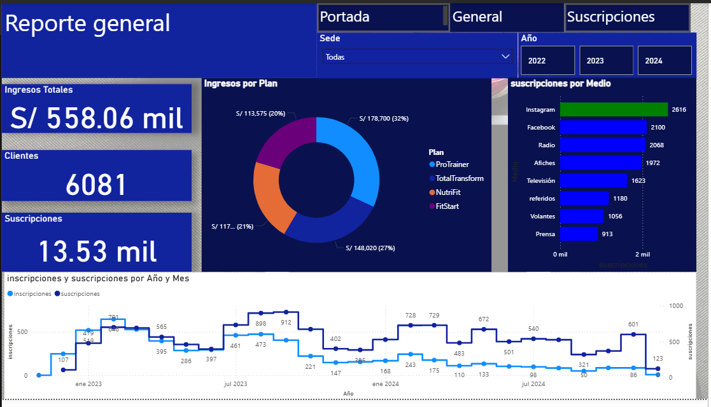
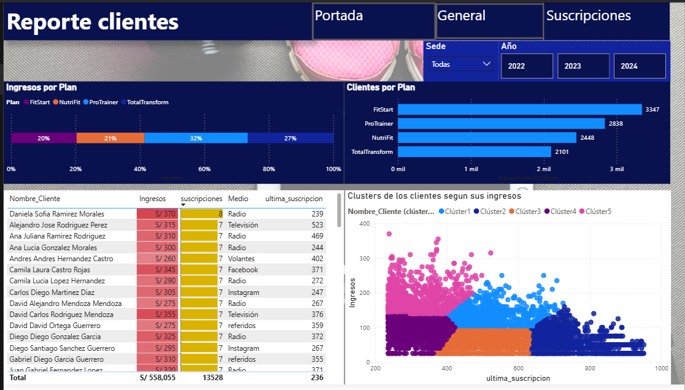

# 📊 Dashboard Interactivo de Gimnasio

Este proyecto muestra un **dashboard interactivo** desarrollado en **Power BI** para analizar los datos de una franquicia de gimnasios en Estados Unidos.

## 🏋️‍♂️ Descripción

El dashboard permite visualizar:
- Ingresos totales y por tipo de plan.
- Número de clientes y suscripciones.
- Medios de captación de clientes.
- Evolución mensual de inscripciones y suscripciones.
- Clusters de clientes según sus ingresos y frecuencia de suscripción.

## 📷 Capturas

### Portada

### Reporte General

### Reporte Clientes

## ⚙️ Tecnologías utilizadas

- **Power BI** para visualización de datos , lenguaje DAX.
- Dataset  de clientes y suscripciones.

## ✅ Conclusiones

- Instagram, Facebook y radio destacan como los medios más efectivos para captar nuevos clientes.
- El plan **ProTrainer** genera el mayor ingreso, seguido de **FitStart** y **NutriFit**.
- Existe una mayor concentración de clientes en los planes más populares, pero también grupos de clientes con ingresos más bajos y menos frecuencia de suscripción.
- Se uso validacion cruzada para confirmar los resultados

## 💡 Recomendaciones

- Potenciar las campañas de marketing en Instagram y Facebook para mantener el flujo de nuevos clientes.
- Explorar incentivos o mejoras para los planes menos contratados y así diversificar ingresos.
- Realizar seguimientos específicos a los clusters de clientes menos frecuentes para aumentar su fidelidad.

## ✏️ Autor

**Diego Arroyo**

📧 diegojulioarroyo@gmail.com 
 
🔗 [Mi LinkedIn](https://www.linkedin.com/in/diego-arroyo-b2153b229/) 

